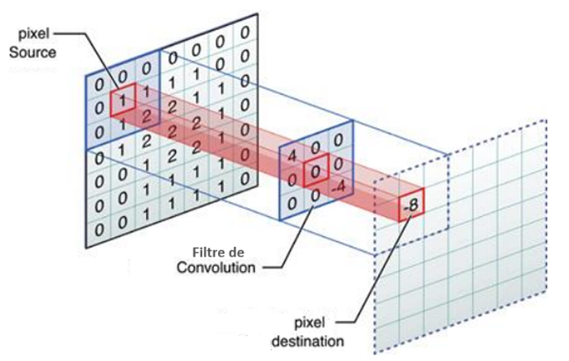

# Produit de convolution

***Le produit de convolution** est une opération mathématique qui combine deux fonctions pour en produire une troisième. Il est largement utilisé en informatique pour le traitement et analyse de données multidimensionnelles, que ce soit en 1D (traitement de signal) ou en 2D/3D (traitement d’images /volumes).*

Dans ce contexte, on se propose dans ce projet , de créer et manipuler des matrices carrées `NxN` qui représente des images 2D.

On se propose aussi d’appliquer des filtres de convolution sur ces images en implémentant le produit de convolution.

On choisir d’utiliser le type natif de Python List de List pour représenter une matrice. Pour indexer l’élément de la ligne `i` et la colonne `j`, on écrira : `matrice[i][j]`, `i=0..N-1` et `j=0..N`.
